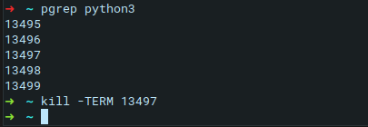
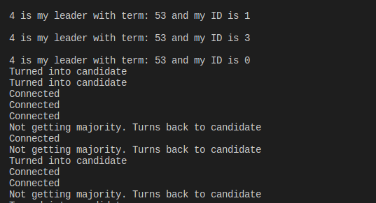
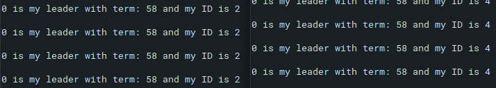

# Overview 
This folder consists of a Leader Election model of the Raft Consensus algorithm widely used in modern distributed systems. 

# Requirements
* Remote Procedure Calls:
    - If you are unfamiliar with Remote Procedure Call in python (RPyC), take a look at this tutorial

* Python Thread libraries:
    - Timer: https://docs.python.org/2/library/threading.html#threading.Timer
    - Event: https://docs.python.org/2/library/threading.html#threading.Event
    - ThreadPoolServer: https://rpyc.readthedocs.io/en/latest/api/utils_server.html

* Raft Protocol 
    - Quick play with this animation: http://thesecretlivesofdata.com/raft/
    - Some detail explaination: https://raft.github.io/
    - Brief description located at ./reference/[CIS_4307]_RaftConsensusProtocol_KhaiNguyen.pdf
    - Full description: https://raft.github.io/raft.pdf

    The implementation must satisfy: 
    - (1) at most one replicated data store is a leader at one time (safety)
    - (2) any majority of the nodes will eventually elect a leader (liveness).

# Building blocks:
* raftnode.py 
* config.txt
* boot_all_nodes.py

Important functions in raftnode.py: 
- enterFollowerState(self)
- enterCandidateState(self)
- get_vote(self, address, port)
- exposed_requestVote(self, term, candidateId)
- exposed_is_leader(self)
- exposed_appendEntries(self, term, leaderId)
- leaderLoop(self)
     
# Testing
* Test of RPyC is working
* Build & test fuctions to requestVote & handling requestVote
* Build & test appendEntries
* electionTimeout mechanism
* Build & test persistent storage files

# Installation (on Linux)
* RPyC
Make sure to remove python2 and install RPyC onto python3

```bash
$ pip3 install rpyc
``` 
# Usage: 

Boot up all nodes in config file

```bash
$ python3 boot_all_nodes.py
```

Check output in the console. Try terminating the leader. As an example below, the leader is node4:


Try terminating node_2 to model a crash

```bash
$ ps auxuw | grep python3 # detail view 
$ pgrep python3  # to see the processes running with python3
....
$ kill -TERM <pID>
```




Next we kill node_4 




Then, we reboot node_2 and node_4 in 2 new terminals
```bash
$ python3 raftnode.py <path to config file> <node_no> <port>
$ python3 raftnode.py ./myconfig.txt 4 60005
```




# Issues
* Did not install rpyc on python3 --> no responses from other servers
* structuring stop_leader Event() flag
* Issues building persistent storage files, need looks for mutual exclusion
* Functions for remote clients must have the ***exposed_*** prefix

# Contribution
* Khai Nguyen (カイ∙グエン): khainguyen@temple.edu
* Dr.Jamie Payton: https://cis.temple.edu/user/444
* Dr.George Porter: http://cseweb.ucsd.edu/~gmporter/