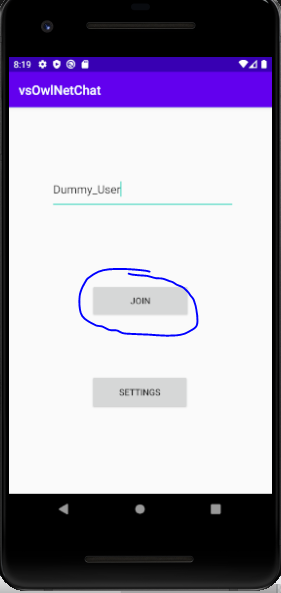

# Khai_Nguyen_Logical_Clocks
Project 3: Lamport and Vector Clock

## Introduction
A basic chat application that monitor message timeouts and event ordering based on Lamport and vector clocks.

## Design
Main files for the program includes:

1. Design 
In \app\src\main\res\layout
* main_activity.xml
* chat_activity.xml
* settings_activity.xml

2. Logial Clocks
In \app\src\main\java\a3\clock
* LamportClock.java
* VectorClock.java

3. Message
In \app\src\main\java\a3\message
* Message.java
* MessageComparator.java
* MessageTypes.java
* ErrorCodes.java

4. Tests
In \app\src\test\java\com\example\vsowlnetchat
* LamportClockTests
* VectorClockTests

## Guide 

1. Start the server:
```bash
$java -jar chat_server.jar 
```

2. User loads up app



3. Client enter userName and hit "Join"


4. Client receive ACK/Error
5. ChatActivity page loads up, "Retrieve Chat Log" or "Deregister" can be chosen
6. "Retrieve Chat Log": message will be received from server & sorted in a PriorityQueue


7. "Deregister": User is kicked out from Registered list by server


## Contributors
Khai Nguyen: khainguyen@temple.edu
